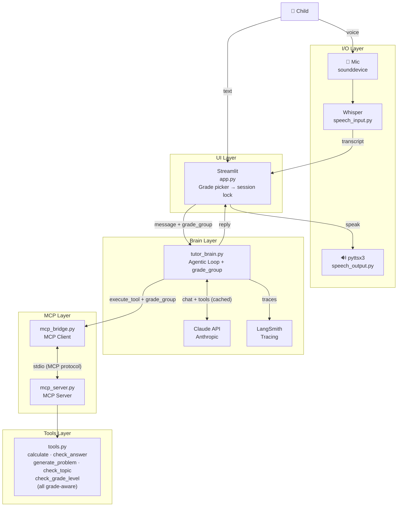

# Lumi — Agentic AI Math Tutor for K–5

> ✨ *"Math Buddy"* — a voice-and-text Socratic math tutor for Kindergarten–Grade 5.


-d97757)


**Lumi** is a voice-and-text AI math tutor for **Kindergarten through Grade 5** (ages 5–10), built on **Claude** with **Model Context Protocol (MCP)** tool-use. Math is verified by **deterministic tools** — the model can never present a wrong answer as correct — while the LLM handles adaptive, grade-aware **Socratic** dialogue. It ships with an **LLM-as-judge evaluation suite**, **LangSmith** observability, and a 10-dimension [reliability assessment](RELIABILITY_ASSESSMENT.md) covering multi-tenancy isolation, COPPA/PII handling, agentic-loop bounds, and cost/latency.

**Stack:** Python · Claude (Anthropic API) · Model Context Protocol (MCP) · Streamlit · LangSmith · OpenAI Whisper

## What This Demonstrates

- **Guardrails for AI serving children** — correctness is hard-enforced in code, not left to the model
- **Agentic tool-use** over MCP, with a bounded loop and a safe fallback
- **Evaluation discipline** — deterministic checks plus an LLM-as-judge (no-spoiler, tool-compliance)
- **Production reliability thinking** — a severity-ranked assessment across 10 dimensions
- **Multi-tenant data isolation** — per-session state so concurrent students never share context

## Features

- **Grade selection** — choose K–2 or Grade 3–5 at the start of each session; locked for that session
- **Voice input** — child speaks; Whisper transcribes locally (4-second recording with live status feedback)
- **Voice output** — Lumi responds aloud via pyttsx3 (emojis stripped before speaking)
- **Voice toggle** — voice I/O is always on for K–2; Grade 3–5 defaults to text-only with an optional sidebar toggle
- **Agentic tool use** — Lumi calls tools via MCP to verify answers (no hallucinated math)
- **Grade-aware guardrails** — K–2 blocks multiplication/fractions; Grade 3–5 allows them but blocks algebra/calculus
- **Prompt caching** — system prompt cached with Anthropic API to reduce latency and cost
- **LangSmith observability** — every conversation turn traced with tool calls, latency, and token usage
- **Debug panel** — toggle tool call inspection in the sidebar

## What Lumi Teaches

| Topic | K–2 (Ages 5–7) | Grade 3–5 (Ages 8–10) |
| --- | --- | --- |
| Counting | 1–20 | — |
| Addition / Subtraction | Within 20 | Within 1,000 |
| Multiplication | ❌ redirected | Times tables 1–12 ✅ |
| Division | ❌ redirected | Within 144 ✅ |
| Fractions | ❌ redirected | ½, ¼, ⅓, ¾ basics ✅ |
| Word problems | Simple (toys, apples) | Multi-step, real-world |

## Tech Stack

| Component | Technology |
| --- | --- |
| UI | Streamlit |
| LLM | Claude Haiku via Anthropic API (configurable via `LUMI_MODEL`) |
| Tool protocol | MCP (Model Context Protocol) |
| Observability | LangSmith (`@traceable` + `wrap_anthropic`) |
| Speech input | OpenAI Whisper (local) |
| Speech output | pyttsx3 |
| Audio recording | sounddevice |

## Architecture



## Reliability & Evaluation

Lumi is built to a production bar, not a demo bar:

- **Deterministic correctness** — `calculate` / `check_answer` verify math via a restricted AST evaluator, so the model cannot present wrong math as correct.
- **Bounded agentic loop** — the tool-use loop is capped (`_MAX_TOOL_ITERATIONS`) with a safe in-character fallback, preventing runaway cost/latency.
- **Multi-tenant isolation** — conversation history is threaded through per-session state so concurrent students never share context.
- **Evaluation suite** (`evals/`) — golden cases, deterministic evaluators, and an **LLM-as-judge** no-spoiler check, run against LangSmith.
- **Full-system reliability assessment** — see **[RELIABILITY_ASSESSMENT.md](RELIABILITY_ASSESSMENT.md)**: ten dimensions (determinism, confidence, human-in-the-loop, auditability, failure modes, multi-tenancy, evaluation, cost/latency, security & COPPA, adaptation fit), each with code evidence and severity-ranked remediation.

## Prerequisites

- Python 3.9–3.13 (Python 3.14 not yet supported by all dependencies)
- [Anthropic API key](https://console.anthropic.com)
- [LangSmith API key](https://smith.langchain.com) *(optional, for tracing)*

## Setup

1. **Clone the repo**

   ```bash
   git clone https://github.com/twisha/lumi-math-tutor.git
   cd lumi-math-tutor
   ```

2. **Install Python dependencies**

   ```bash
   pip install -r requirements.txt
   ```

3. **Configure environment**

   ```bash
   cp .env.example .env
   ```

   Edit `.env` and fill in your keys:

   ```env
   # Required
   ANTHROPIC_API_KEY=your_api_key_here
   LUMI_MODEL=claude-haiku-4-5-20251001

   # Optional — enables LangSmith tracing at smith.langchain.com
   LANGSMITH_API_KEY=your_langsmith_key_here
   LANGSMITH_TRACING=true
   LANGSMITH_PROJECT=lumi-math-tutor
   ```

   To use a different Claude model, change `LUMI_MODEL` (e.g. `claude-sonnet-4-6`).

## Running the App

```bash
export $(cat .env | xargs) && streamlit run app.py
```

Then open [http://localhost:8501](http://localhost:8501) in your browser, select a grade group, and start the session.

## Project Structure

```text
lumi-math-tutor/
├── app.py                # Streamlit UI + grade picker
├── requirements.txt      # Python dependencies
├── .env.example          # Environment variable template
├── presentation.html     # Project summary slide deck
└── core/
    ├── prompts.py        # Grade-specific system prompts (K2 + 3-5)
    ├── tutor_brain.py    # Agentic loop (Claude API + LangSmith + grade_group)
    ├── tools.py          # Grade-aware tool implementations
    ├── mcp_server.py     # MCP server exposing tools over stdio
    ├── mcp_bridge.py     # MCP client → Anthropic tool format bridge
    ├── speech_input.py   # Mic recording + Whisper transcription
    └── speech_output.py  # pyttsx3 text-to-speech (emoji-stripped)
```

## Usage

| Action | How |
| --- | --- |
| Choose grade | Select **K–2** or **Grade 3–5** on the start screen |
| Voice input | Click **Tap to Talk!**, speak for 4 seconds *(K–2 only by default)* |
| Text input | Type in the text box and click **Send** |
| New session | Click **New Session** in the sidebar (resets grade selection) |
| Debug tools | Toggle **Show tool calls** in the sidebar |
| View traces | Open [smith.langchain.com](https://smith.langchain.com) → `lumi-math-tutor` project |

## Design Decisions

### Why Streamlit instead of Chainlit

Chainlit is purpose-built for chat UIs and was a natural candidate for this project. It was prototyped on the `feature/improvements` branch but was not used in `main` for three reasons:

1. **Python compatibility.** Chainlit requires Python ≤ 3.12. This project targets Python 3.9–3.13 and uses `sounddevice` + `pyttsx3` for voice I/O; dropping Python 3.13 support for a UI framework was not worth the trade-off.

2. **Synchronous voice pipeline.** `pyttsx3` and `sounddevice` are blocking, synchronous libraries. Chainlit's async-first architecture requires wrapping every blocking call in `asyncio.run_in_executor`, adding boilerplate and making the recording/playback flow harder to reason about. Streamlit's simpler threading model works naturally with the voice pipeline.

3. **Grade-picker session state.** Lumi's session flow (grade selection → locked session → reset) maps cleanly onto Streamlit's `st.session_state`. Replicating the same locked-grade UX in Chainlit required custom session middleware that added complexity without user-facing benefit.

Chainlit remains available on the `feature/improvements` branch for environments that meet its Python requirement and do not need local voice I/O.

## Branches

| Branch | Description |
| --- | --- |
| `main` | Stable — Streamlit UI, Claude API, MCP tools, LangSmith |
| `feature/improvements` | Chainlit + LangSmith UI (requires Python ≤ 3.12) |
