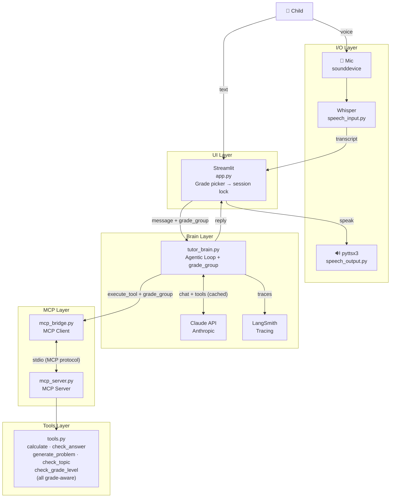

# ✨ Lumi — Math Buddy

A voice-enabled AI math tutor for **Kindergarten through Grade 5** (ages 5–10). Lumi adapts to the selected grade group, guiding students through age-appropriate math with verified answers, warm guardrails, and full observability via LangSmith — powered by Claude AI with MCP-based tool use.

## Features

- **Grade selection** — choose K–2 or Grade 3–5 at the start of each session; locked for that session
- **Voice input** — child speaks; Whisper transcribes locally (4-second recording with real-time status)
- **Voice output** — Lumi responds aloud via pyttsx3 (emojis stripped before speaking)
- **Agentic tool use** — Lumi calls tools via MCP to verify answers (no hallucinated math)
- **Grade-aware guardrails** — K–2 blocks multiplication/fractions; Grade 3–5 allows them but blocks algebra/calculus
- **Prompt caching** — system prompt cached with Anthropic API to reduce latency and cost
- **LangSmith observability** — every conversation turn traced with tool calls, latency, and token usage
- **Debug panel** — toggle tool call inspection in the sidebar

## What Lumi Teaches

| Topic | K–2 (Ages 5–7) | Grade 3–5 (Ages 8–10) |
| --- | --- | --- |
| Counting | 1–20 | — |
| Addition / Subtraction | Within 20 | Within 1,000 |
| Multiplication | ❌ redirected | Times tables 1–12 ✅ |
| Division | ❌ redirected | Within 144 ✅ |
| Fractions | ❌ redirected | ½, ¼, ⅓, ¾ basics ✅ |
| Word problems | Simple (toys, apples) | Multi-step, real-world |

## Tech Stack

| Component | Technology |
| --- | --- |
| UI | Streamlit |
| LLM | Claude Haiku via Anthropic API (configurable via `LUMI_MODEL`) |
| Tool protocol | MCP (Model Context Protocol) |
| Observability | LangSmith (`@traceable` + `wrap_anthropic`) |
| Speech input | OpenAI Whisper (local) |
| Speech output | pyttsx3 |
| Audio recording | sounddevice |

## Architecture



## Prerequisites

- Python 3.9–3.13 (Python 3.14 not yet supported by all dependencies)
- [Anthropic API key](https://console.anthropic.com)
- [LangSmith API key](https://smith.langchain.com) *(optional, for tracing)*

## Setup

1. **Clone the repo**

   ```bash
   git clone https://github.com/twisha/lumi-math-tutor.git
   cd lumi-math-tutor
   ```

2. **Install Python dependencies**

   ```bash
   pip install -r requirements.txt
   ```

3. **Configure environment**

   ```bash
   cp .env.example .env
   ```

   Edit `.env` and fill in your keys:

   ```env
   # Required
   ANTHROPIC_API_KEY=your_api_key_here
   LUMI_MODEL=claude-haiku-4-5-20251001

   # Optional — enables LangSmith tracing at smith.langchain.com
   LANGSMITH_API_KEY=your_langsmith_key_here
   LANGSMITH_TRACING=true
   LANGSMITH_PROJECT=lumi-math-tutor
   ```

   To use a different Claude model, change `LUMI_MODEL` (e.g. `claude-sonnet-4-6`).

## Running the App

```bash
export $(cat .env | xargs) && streamlit run app.py
```

Then open [http://localhost:8501](http://localhost:8501) in your browser, select a grade group, and start the session.

## Project Structure

```text
lumi-math-tutor/
├── app.py                # Streamlit UI + grade picker
├── requirements.txt      # Python dependencies
├── .env.example          # Environment variable template
├── presentation.html     # Project summary slide deck
└── core/
    ├── prompts.py        # Grade-specific system prompts (K2 + 3-5)
    ├── tutor_brain.py    # Agentic loop (Claude API + LangSmith + grade_group)
    ├── tools.py          # Grade-aware tool implementations
    ├── mcp_server.py     # MCP server exposing tools over stdio
    ├── mcp_bridge.py     # MCP client → Anthropic tool format bridge
    ├── speech_input.py   # Mic recording + Whisper transcription
    └── speech_output.py  # pyttsx3 text-to-speech (emoji-stripped)
```

## Usage

| Action | How |
| --- | --- |
| Choose grade | Select **K–2** or **Grade 3–5** on the start screen |
| Voice input | Click **Tap to Talk!**, speak for 4 seconds |
| Text input | Type in the text box and click **Send** |
| New session | Click **New Session** in the sidebar (resets grade selection) |
| Debug tools | Toggle **Show tool calls** in the sidebar |
| View traces | Open [smith.langchain.com](https://smith.langchain.com) → `lumi-math-tutor` project |

## Branches

| Branch | Description |
| --- | --- |
| `main` | Stable — Streamlit UI, Claude API, MCP tools, LangSmith |
| `feature/improvements` | Chainlit + LangSmith UI (requires Python ≤ 3.12) |
