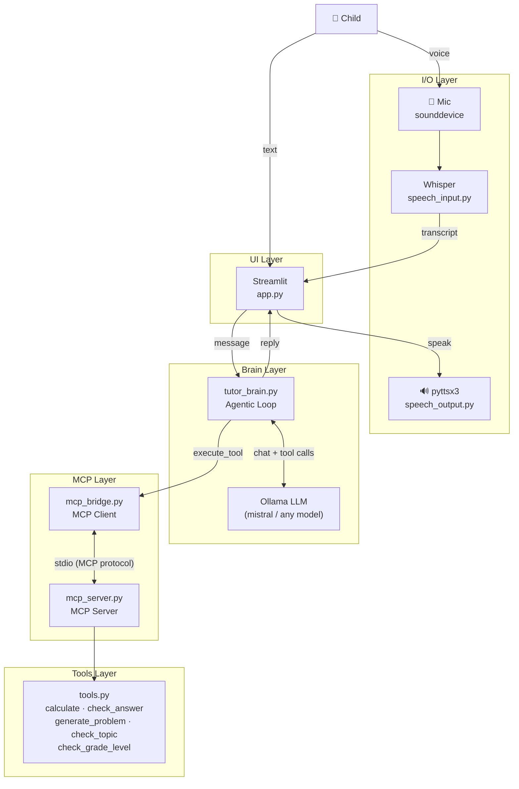

# ✨ Lumi — Math Buddy

A locally-run, voice-enabled AI math tutor for Kindergarten through 2nd grade (ages 5–7). Lumi guides children through counting, addition, and subtraction using a warm, patient, and playful persona — with no data ever sent to the cloud.

## Features

- **Voice input** — child speaks; Whisper transcribes locally
- **Voice output** — Lumi responds aloud via pyttsx3
- **Agentic tool use** — Lumi calls tools to verify answers before responding (no hallucinated math)
- **Guardrails** — redirects off-topic chat and out-of-grade questions warmly
- **Debug panel** — toggle to inspect tool calls in the sidebar
- **100% local** — Ollama + Whisper + pyttsx3, no API keys required

## What Lumi Teaches

- Counting (1–20)
- Number recognition and ordering
- Addition and subtraction within 20
- Simple word problems using everyday objects

## Tech Stack

| Component | Technology |
| --- | --- |
| UI | Streamlit |
| LLM | Mistral via Ollama (model-agnostic via `LUMI_MODEL` env var) |
| LLM API | OpenAI-compatible client → `localhost:11434` |
| Tool protocol | MCP (Model Context Protocol) |
| Speech input | OpenAI Whisper (local) |
| Speech output | pyttsx3 |
| Audio recording | sounddevice |

## Architecture



## Prerequisites

- Python 3.9+
- [Ollama](https://ollama.com) installed and running

## Setup

1. **Clone the repo**

   ```bash
   git clone https://github.com/twisha/lumi-math-tutor.git
   cd lumi-math-tutor
   ```

2. **Install Python dependencies**

   ```bash
   pip install -r requirements.txt
   ```

3. **Pull the model**

   ```bash
   ollama pull mistral
   ```

   To use a different model, set the `LUMI_MODEL` env var (e.g. `LUMI_MODEL=llama3.1`).

## Running the App

In one terminal, start Ollama:

```bash
ollama serve
```

In another terminal, start the app:

```bash
streamlit run app.py
```

Then open [http://localhost:8501](http://localhost:8501) in your browser and click **Start Session with Lumi!**

## Project Structure

```text
lumi-math-tutor/
├── app.py                # Streamlit UI
├── requirements.txt      # Python dependencies
├── core/
│   ├── prompts.py        # Lumi's system prompt and persona
│   ├── tutor_brain.py    # Agentic loop (LLM + tool calls)
│   ├── tools.py          # Pure Python tool implementations
│   ├── mcp_server.py     # MCP server exposing tools over stdio
│   ├── mcp_bridge.py     # MCP client → OpenAI tool format bridge
│   ├── speech_input.py   # Mic recording + Whisper transcription
│   └── speech_output.py  # pyttsx3 text-to-speech
```

## Usage

| Input method | How |
| --- | --- |
| Voice | Click **Tap to Talk!**, speak for up to 5 seconds |
| Text | Type in the text box and click **Send** |
| New session | Click **New Session** in the sidebar |
| Debug tools | Toggle **Show tool calls** in the sidebar |
